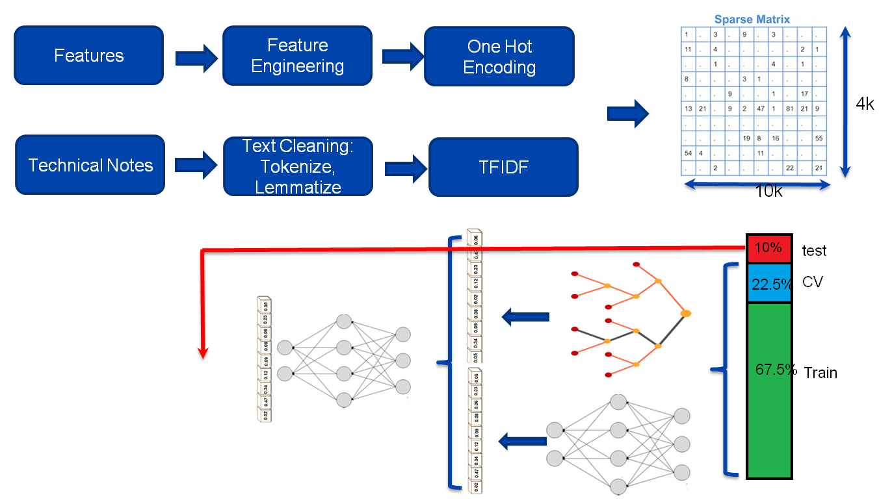
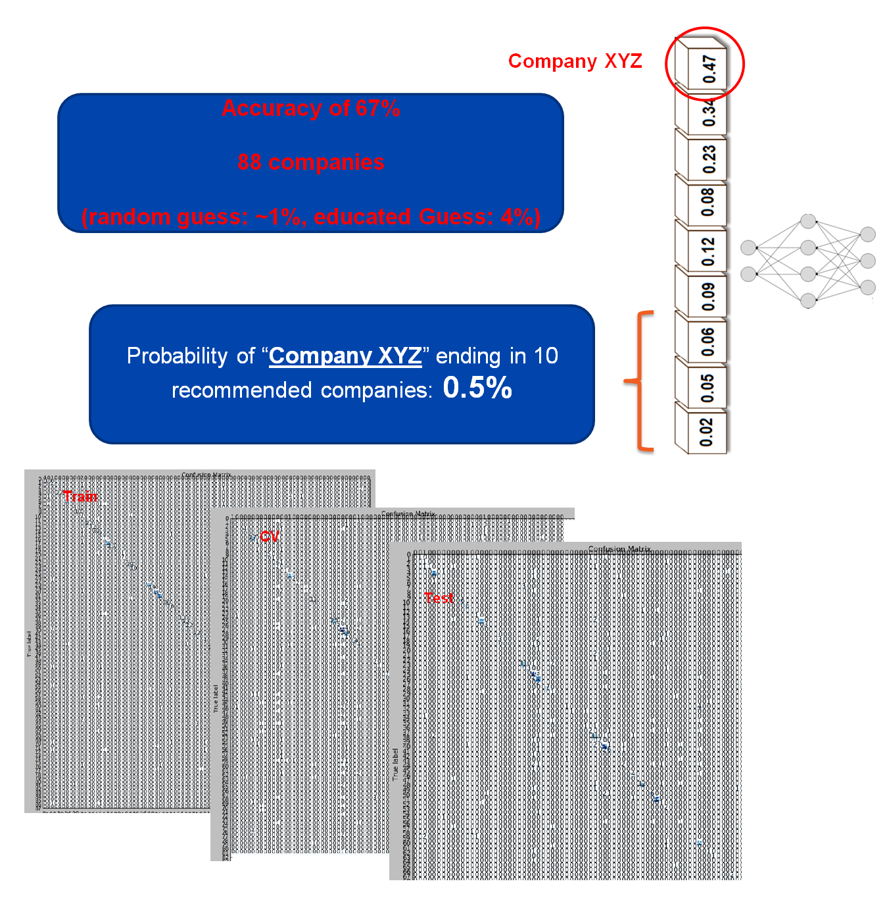

# Reducing the risk associated with investing in pipeline projects
This is a 3-week research project performed for Insight program in Jan 2020 in Toronto. The objective is to avoid high-risk companies for any upcoming pipeline project considering the project specifications. 

## Summary
This project helps minimizing the risk associated with investing in pipeline industries. It uses feature engineering and NLP for extracting features from text and pipeline specifications, and it suggests companies that have minimum risk considering the output.

## Approach
Data was collected from US department of transportation for pipeline failures in US over past 20 years. For each incident the regulator collected pipeline specifications in details, together with a technical note that explains the observations and details of the incident. One_Hot_Encoding was performed on features and TFIDF on text, and their result was merged and fed to an ensemble stacked model formed from random forest and neural network. 

## Result
Providing the details of an incident, the model predicts with 68% of accuracy that which pipeline company caused the failure. This training is used to avoid high risk companies for upcoming projects, also to recommend minimum risk companies considering the project specifications.

